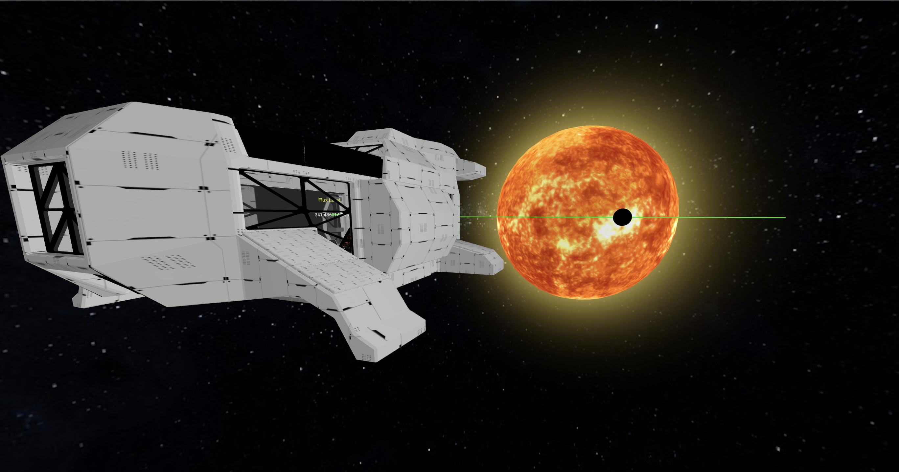

## DISCLAIMER FOR NASA SPACE APPS CHALLENAGE 2024

This repository is open for **open-source contributions**, but **does NOT contain** the **version submitted** to the **NASA Space Apps Challenge 2024**.
The version of this project submitted to the competition is preserved in the **`main`** branch and **remains unchanged** for the integrity of our submission.

- The `master` branch is for **active** development and open contributions.
- Contributions here will not affect the submitted project and will only impact ongoing improvements for the community.
- The live site linked in our submission remains based on the main branch.
  We encourage you to contribute, fork, and experiment, but note that the **contest version is frozen**.

---

<div align="center">
    
</div>




## Setup

Make sure to install the dependencies:

```bash
pnpm install
```

## Development Server

> [!WARNING]
> In order to run it locally (workaround for now), in `nuxt.config.ts` make sure to change:

```ts
  app: {
    baseURL: "./",
```

to:

```ts
  app: {
    baseURL: "/exoplanet-quest-web/",
```

Start the development server on `http://localhost:3000`:

```bash
pnpm run dev
```

## Production

Build the application for production:

```bash
# pnpm
pnpm run build
```

Locally preview production build:

```bash
# pnpm
pnpm run preview
```

---

# Exoplanet Classification and Synthetic Data Generation

## Overview

This project focuses on classifying exoplanets using data from the [NASA Exoplanet Archive](https://exoplanetarchive.ipac.caltech.edu/cgi-bin/TblView/nph-tblView?app=ExoTbls&config=koi) and synthesizing new realistic data. Two machine learning models, **Support Vector Classifier (SVC)** and **Random Forest Classifier (RFC)**, were trained and combined using a model fusion technique. Additionally, **GaussianCopulaSynthesizer** was used to generate synthetic tabular data, and the most realistic data was selected according to the fused model.

## Dataset

The dataset used for training the models is the **Kepler Objects of Interest (KOI)** dataset, which contains data related to potential exoplanet candidates observed by the Kepler space telescope. The dataset includes features like orbital period, planetary radius, and stellar temperature, among others, which are useful for distinguishing between confirmed exoplanets and false positives.

## Models

1. **Support Vector Classifier (SVC)**

   - A classification algorithm effective for high-dimensional spaces and used for both binary and multi-class classification.
   - Achieved an F1 score of approximately 98% on the validation set.

2. **Random Forest Classifier (RFC)**
   - An ensemble learning method that constructs multiple decision trees during training and outputs the mode of the classes for classification.
   - Also achieved an F1 score of around 98% on the validation set.

### Model Fusion

To improve classification performance and ensure an even distribution of classifications across exoplanets and non-exoplanets, **majority voting** was employed to fuse the two models. The fusion approach combines the predictions of both SVC and RFC, and the final output is the class predicted by the majority of the models.

### Synthetic Data Generation

Using the **GaussianCopulaSynthesizer**, new synthetic data was generated based on the patterns observed in the original dataset. The synthetic data aimed to replicate the distributions of key features while avoiding overfitting to the specific instances in the training data.

After generating the synthetic data, the fused model was used to evaluate and select the most realistic synthetic data based on the classification confidence and accuracy.
